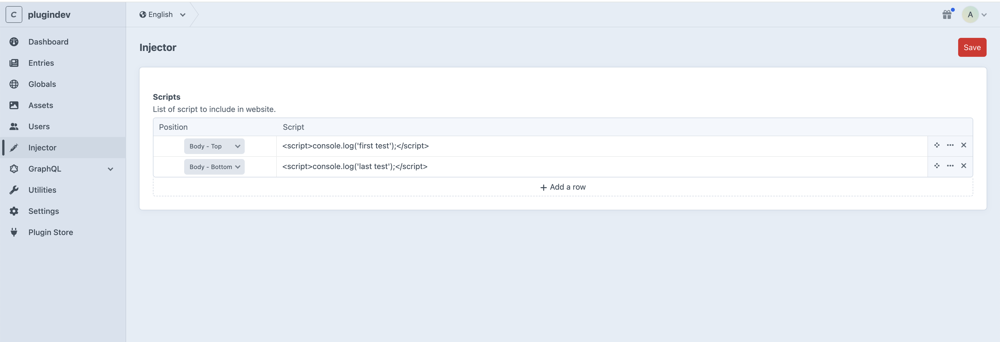

# Injector

Injector is a CraftCms plugin used to inject tracking scripts in your website.

## Requirements

This plugin requires : 
- Craft CMS 5.0.0 or later.
- PHP 8.2 or later.
- Mysql database

## Installation

You can install this plugin from the Plugin Store or with Composer.

#### From the Plugin Store

Go to the Plugin Store in your project’s Control Panel and search for “Injector". Then press “Install”.

#### With Composer

Open your terminal and run the following commands:

```bash
# tell Composer to load the plugin
composer require quatrecentquatre/craft-injector

# tell Craft to install the plugin
./craft plugin/install craft-injector
```

## How it works

In the menu, a section called Injector is added once the plugin is properly installed. 

From this page, you have the possibility to add scripts by choosing the position in the page. 
- Head
- Top of the body
- Bottom of the body

The value can be different from site to site.

The section is only available to admin users or users with the permission to access the plugin.



### Credits
Developped by : [QuatreCentQuatre](https://www.quatrecentquatre.com)<br>
Developper : [Robin Gauthier](https://github.com/robin-gauthier)
